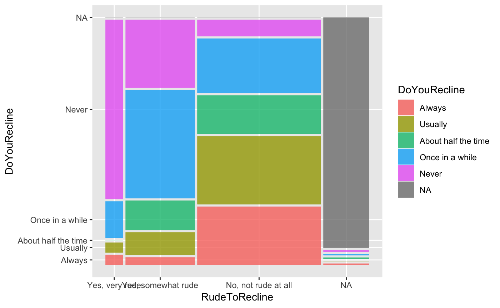

<!-- README.md is generated from README.Rmd. Please edit that file -->

[](https://cran.r-project.org/package=ggmosaic)
[](http://www.r-pkg.org/pkg/ggmosaic)
[](https://travis-ci.org/haleyjeppson/ggmosaic)

# ggmosaic

ggmosaic was designed to create visualizations of categorical data and
is capable of producing bar charts, stacked bar charts, mosaic plots,
and double decker plots.

## Installation

You can install ggmosaic from github with:

``` r
# install.packages("devtools")
devtools::install_github("haleyjeppson/ggmosaic")
```

## Example

``` r
library(ggmosaic)
#> Loading required package: ggplot2
ggplot(data = fly) +
  geom_mosaic(aes(x = product(RudeToRecline), fill=DoYouRecline)) +
  scale_x_productlist()
```

<!-- -->

## geom\_mosaic: setting the aesthetics

Aesthetics that can be set:

  - **weight** : select a weighting variable
  - **x** : select variables to add to formula
      - declared as **x** = product(x1, x2, …)
  - **fill** : select a variable to be filled
      - if the variable is not also called in **x**, it will be added to
        the formula in the first position
  - **conds** : select a variable to condition on

These values are then sent through `productplots` functions to create
the formula for the desired distribution

**Formula:** weight ~ fill + x | conds

### From the aesthetics to the formula

Example of how the formula is built

  - **weight** = 1
  - **x** = product(Y, X)
  - **fill** = W
  - **conds** = Z

These aesthetics set up the formula for the distribution: 1 ~ W + X + Y
| Z

Because a mosaic plot is constructed hierarchically through alternating
spines, the ordering of the variables is very important.
